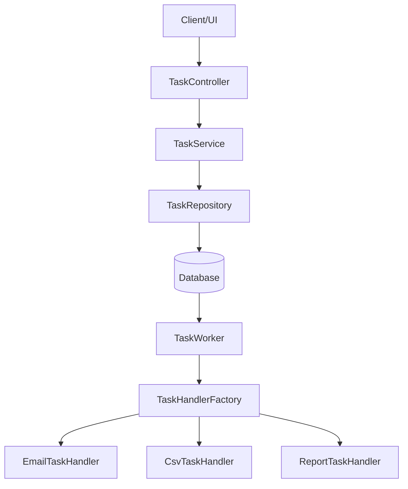
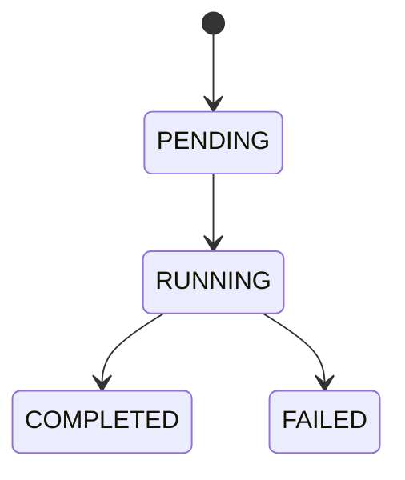

#  Distributed Task Queue System


---

##  Overview

A **Distributed Task Queue System** built using **Spring Boot**, designed to handle asynchronous job execution with background workers.

This system models real-world queue systems like:

* Celery
* AWS SQS
* RabbitMQ

It enables:

* Asynchronous task execution
* Background processing
* Task lifecycle tracking
* Pluggable task handling

---

##  Phase 1 Scope

Aligned with requirements:

* ✔ Task submission API
* ✔ Background worker
* ✔ FIFO queue processing
* ✔ Task lifecycle tracking
* ✔ Input validation & error handling

---

##  System Architecture



---

## ⚙️ Tech Stack

| Layer         | Technology        |
| ------------- | ----------------- |
| Backend       | Spring Boot       |
| Language      | Java              |
| Database      | PostgreSQL (Neon) |
| Serialization | Jackson           |
| Testing       | JUnit             |

---

##  Project Structure

### 🔹 Main Source (`src/main/java`)

```bash
com.aditya.distributed_task_queue
│
├── controller/
├── dto/
├── handler/
├── model/
├── repository/
├── service/
├── worker/
└── DistributedTaskQueueApplication.java
```

---

### 🔹 Test Structure (`src/test/java`)

```bash
com.aditya.distributed_task_queue
│
├── controller/
├── handler/
├── service/
├── worker/
└── DistributedTaskQueueApplicationTests.java
```

---

##  Setup & Running Instructions

### Prerequisites

* Java 17+
* Maven
* PostgreSQL / Neon DB

---

### Database Configuration

Update `application.properties`:

```properties
spring.datasource.url=your-neon-connection-url
spring.datasource.username=your-username
spring.datasource.password=your-password

spring.jpa.hibernate.ddl-auto=update
```

---

### Run Application

```bash
./mvnw spring-boot:run
```

Application runs at:

```
http://localhost:8080
```

---

## Database Design & Migration

### Database

This project uses **Neon (serverless PostgreSQL)**.

---

### Schema File

```
sql/schema.sql
```

---

### Table: `tasks`

```sql
CREATE TABLE tasks (
    task_id UUID PRIMARY KEY,
    task_type VARCHAR(50) NOT NULL,
    payload TEXT,
    status VARCHAR(20) NOT NULL,
    result TEXT,
    error TEXT,
    created_at TIMESTAMP NOT NULL,
    started_at TIMESTAMP,
    completed_at TIMESTAMP
);
```

---

### Current Strategy

* Using JPA auto schema generation:

```properties
spring.jpa.hibernate.ddl-auto=update
```

---

### Future Migration Plan

* Flyway / Liquibase
* Additional tables:

  * task_results
  * task_dependencies
  * dead_letter_queue

---

## Task Lifecycle



---

## API Documentation

A Postman collection is included.

Location:

```
postman/task-queue.postman_collection.json
```

---

### 🔹 Endpoints

| Method | Endpoint         | Description |
| ------ | ---------------- | ----------- |
| POST   | `/tasks`         | Create task |
| GET    | `/tasks/{id}`    | Get task    |
| GET    | `/tasks`         | Get all     |
| GET    | `/tasks?status=` | Filter      |

---

### Example Request

```json
{
  "taskType": "email_send",
  "payload": {
    "to": "test@example.com",
    "subject": "Hello",
    "body": "Test Email"
  }
}
```

---

### How to Use

1. Open Postman
2. Import collection
3. Run requests

---

## Features Implemented

* Task submission API (non-blocking)
* Background worker (polling)
* Task lifecycle tracking
* Strong validation
* Strategy-based handlers
* Execution time tracking
* Error handling

---

## UI Flow


---

## Testing

### Run Tests

```bash
./mvnw test
```

---

### ✔ Coverage Includes

* Controller
* Service
* Worker
* Handlers

---

##  Limitations

* No priority queue
* No retry mechanism
* No scheduling
* No distributed workers

---

## Roadmap

### Phase 2

* Priority Queue
* Retry Logic
* Task Dependencies
* Scheduled Tasks

### Phase 3

* Kafka / Redis integration
* Horizontal scaling
* Dead Letter Queue
* Monitoring dashboard

---

## Code Documentation

* Class-level comments
* Method-level documentation
* Inline explanations for critical logic

Key components documented:

* TaskWorker
* TaskController
* TaskService
* TaskHandlers

---

## Run the Project

```bash
git clone https://github.com/your-username/distributed-task-queue.git
cd distributed-task-queue
./mvnw spring-boot:run
```

---

## Author

**Aditya Halder**

---

## Final Note

This Phase 1 system delivers:

✔ Async task execution
✔ Clean architecture
✔ Strong validation
✔ Structured testing

Ready for **Phase 2 scaling and production evolution**