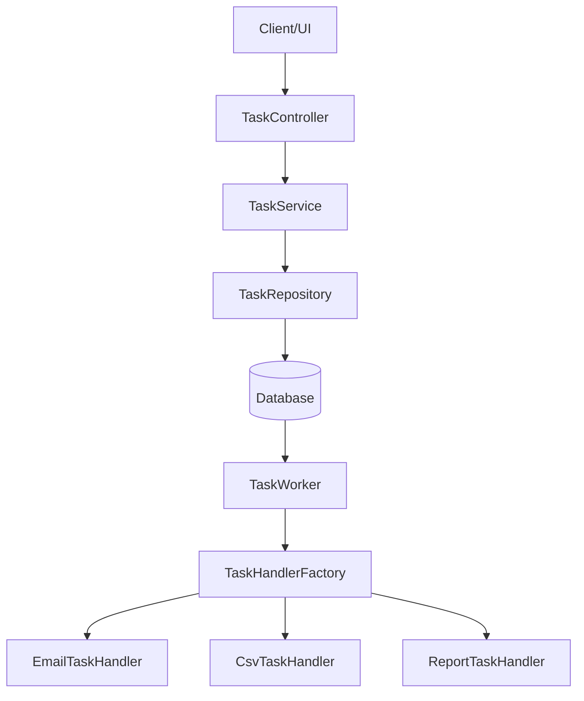
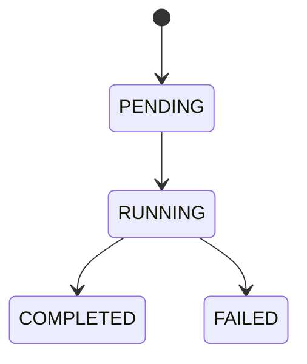
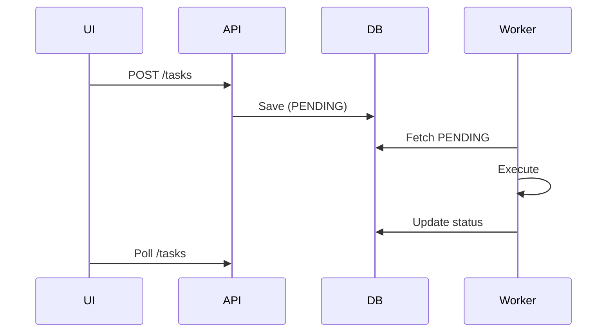

# Distributed Task Queue System

## Overview

A **Distributed Task Queue System** built using **Spring Boot**, designed to handle asynchronous job execution with background workers.

This system models real-world queue systems like:

* Celery
* AWS SQS
* RabbitMQ

It enables:

* Asynchronous task execution
* Background processing
* Task lifecycle tracking
* Pluggable task handling

---

## Phase 1 Scope

Aligned with official requirements :

* ✔ Task submission API
* ✔ Background worker
* ✔ FIFO queue processing
* ✔ Task lifecycle tracking
* ✔ Input validation & error handling

---

## System Architecture



---

## Tech Stack

| Layer         | Technology   |
| ------------- | ------------ |
| Backend       | Spring Boot  |
| Language      | Java         |
| Database      | JPA (SQL DB) |
| Serialization | Jackson      |
| Testing       | JUnit        |

---

## Project Structure

### 🔹 Main Source (`src/main/java`)

```bash
com.aditya.distributed_task_queue
│
├── controller/
│   └── TaskController.java
│
├── dto/
│   └── TaskRequest.java
│
├── handler/
│   ├── TaskHandler.java
│   ├── TaskHandlerFactory.java
│   └── implementation/
│       ├── CsvTaskHandler.java
│       ├── EmailTaskHandler.java
│       └── ReportTaskHandler.java
│
├── model/
│   ├── Task.java
│   └── TaskStatus.java
│
├── repository/
│   └── TaskRepository.java
│
├── service/
│   └── TaskService.java
│
├── worker/
│   └── TaskWorker.java
│
└── DistributedTaskQueueApplication.java
```

---

### 🔹 Test Structure (`src/test/java`)

```bash
com.aditya.distributed_task_queue
│
├── controller/
│   └── TaskControllerTest.java
│
├── handler/
│   ├── CsvTaskHandlerTest.java
│   ├── EmailTaskHandlerTest.java
│   └── ReportTaskHandlerTest.java
│
├── service/
│   └── TaskServiceTest.java
│
├── worker/
│   └── TaskWorkerTest.java
│
└── DistributedTaskQueueApplicationTests.java
```

---

# Database Design

## Current Schema (Phase 1)

The system uses a **database-backed queue design**, where tasks are stored and processed asynchronously by workers.

### Table: `tasks`

```sql
CREATE TABLE tasks (
    task_id UUID PRIMARY KEY,
    task_type VARCHAR(50) NOT NULL,
    payload TEXT,
    status VARCHAR(20) NOT NULL,
    result TEXT,
    error TEXT,
    created_at TIMESTAMP NOT NULL,
    started_at TIMESTAMP,
    completed_at TIMESTAMP
);
```

---

### Column Breakdown

| Column         | Type        | Description                                                  |
| -------------- | ----------- | ------------------------------------------------------------ |
| `task_id`      | UUID        | Unique identifier for each task                              |
| `task_type`    | VARCHAR(50) | Task type (`email_send`, `csv_process`, `report_generation`) |
| `payload`      | TEXT        | JSON payload stored as string                                |
| `status`       | VARCHAR(20) | Current state (`PENDING`, `RUNNING`, `COMPLETED`, `FAILED`)  |
| `result`       | TEXT        | Execution result                                             |
| `error`        | TEXT        | Error message if task fails                                  |
| `created_at`   | TIMESTAMP   | Task creation time                                           |
| `started_at`   | TIMESTAMP   | Execution start time                                         |
| `completed_at` | TIMESTAMP   | Execution end time                                           |

---

### Lifecycle Mapping

```text
PENDING → RUNNING → COMPLETED / FAILED
```

---

### Design Decisions

#### 1. Database as Queue

* Tasks are stored in DB and polled by worker
* Simpler alternative to message brokers (Phase 1)

---

#### 2. Flexible Payload Storage

* Payload stored as JSON (TEXT)
* Supports multiple task types without schema changes

---

#### 3. Execution Tracking

* Timestamps enable:

  * Execution time calculation
  * Debugging
  * Monitoring

---

#### 4. Observability

* `result` → success output
* `error` → failure reason

---

## Future Schema (Phase 2 & 3)

To scale the system into a **production-grade distributed architecture**, the following extensions are planned:

---

### 🔹 Task Results Table

```sql
CREATE TABLE task_results (
    task_id UUID PRIMARY KEY,
    result TEXT,
    error_message TEXT,
    execution_time BIGINT
);
```

---

### 🔹 Task Dependencies (Chaining)

```sql
CREATE TABLE task_dependencies (
    id SERIAL PRIMARY KEY,
    parent_task_id UUID,
    child_task_id UUID
);
```

Supports workflows like:

```text
Task A → Task B → Task C
```

---

### 🔹 Extended Task Fields

```sql
ALTER TABLE tasks ADD COLUMN priority INT DEFAULT 0;
ALTER TABLE tasks ADD COLUMN retry_count INT DEFAULT 0;
ALTER TABLE tasks ADD COLUMN max_retries INT DEFAULT 3;
ALTER TABLE tasks ADD COLUMN scheduled_at TIMESTAMP;
```

---

### 🔹 Dead Letter Queue (DLQ)

```sql
CREATE TABLE dead_letter_queue (
    id SERIAL PRIMARY KEY,
    task_id UUID,
    error TEXT,
    failed_at TIMESTAMP
);
```

---

## 📈 Evolution Strategy

| Phase   | Storage Strategy                    |
| ------- | ----------------------------------- |
| Phase 1 | DB-backed queue                     |
| Phase 2 | Priority + Retry + Scheduling       |
| Phase 3 | Kafka / Redis + Distributed Workers |


---

## Task Lifecycle



Defined in `TaskStatus` 

---

## Features Implemented

### Task Submission API

* `POST /tasks`
* Non-blocking
* Returns `task_id`

Implemented in `TaskController` 

---

### Strong Input Validation

* Task type validation
* Payload validation
* Task-specific schema checks

Examples:

* Email → `to`, `subject`, `body`
* CSV → `fileName`
* Report → `reportType`

---

### Background Worker

* Runs continuously in a separate thread
* Polls database every 2 seconds
* Processes PENDING tasks

✔ Implemented in `TaskWorker` 

---

### Pluggable Task Execution (Strategy Pattern)

* `TaskHandler` interface 
* Factory-based handler resolution 

Supported handlers:

* Email Task
* CSV Processing
* Report Generation

---

### Task Status Tracking

* Fetch by ID
* Fetch all tasks
* Filter by status

Implemented in `TaskService` 

---

### Execution Metadata

Each task tracks:

* createdAt
* startedAt
* completedAt
* result
* error

Defined in `Task` entity 

---

### Error Handling

* Invalid input → HTTP 400
* Execution failure → FAILED state
* Error stored in DB

---

### Execution Time Tracking

```text
Success (Execution Time: X ms)
```

---

## API Endpoints

### ➤ Create Task

```http
POST /tasks
```

```json
{
  "taskType": "email_send",
  "payload": {
    "to": "test@example.com",
    "subject": "Hello",
    "body": "Test Email"
  }
}
```

---

### ➤ Get Task

```http
GET /tasks/{id}
```

---

### ➤ Get All Tasks

```http
GET /tasks
```

---

### ➤ Filter Tasks

```http
GET /tasks?status=COMPLETED
```

---

## UI Flow



---

## Testing

Unit tests implemented for:

* Controller layer
* Service layer
* Worker logic
* Task handlers

Structured test hierarchy improves maintainability and reliability.

---

## Limitations (Phase 1)

* No priority queue
* No retry mechanism
* No scheduling
* No distributed workers
* DB polling (not event-driven)

---

## Roadmap

### Phase 2

* Priority Queue
* Retry Logic
* Task Dependencies
* Scheduled Tasks

### Phase 3

* Horizontal Scaling
* Dead Letter Queue (DLQ)
* Monitoring Dashboard
* Webhooks

---

## Design Highlights

* Clean layered architecture
* Strategy pattern for extensibility
* Strong validation
* Database-backed queue
* Fault-tolerant worker design
* Testable modular components

---

## Running the Project

```bash
git clone https://github.com/your-username/distributed-task-queue.git
cd distributed-task-queue
./mvnw spring-boot:run
```

---

## Author

**Aditya Halder**

---

## Final Note

This Phase 1 system delivers:

✔ End-to-end async processing
✔ Clean, extensible architecture
✔ Strong validation + reliability
✔ Structured test coverage

Ready for **Phase 2 enhancements and scaling**

