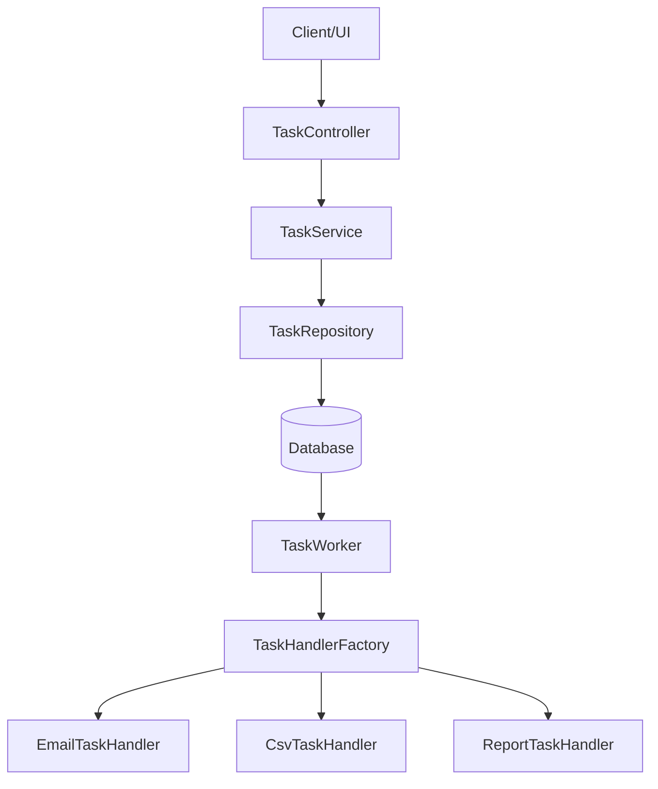
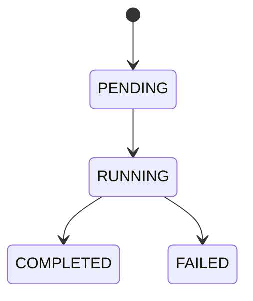
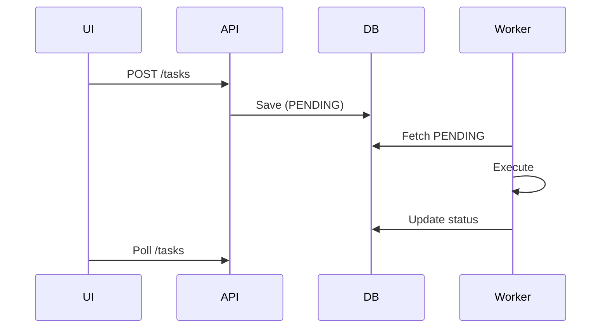

# 🚀 Distributed Task Queue System


---

## 📌 Overview

A **Distributed Task Queue System** built using **Spring Boot**, designed to handle asynchronous job execution with background workers.

This system models real-world queue systems like:

* Celery
* AWS SQS
* RabbitMQ

It enables:

* Asynchronous task execution
* Background processing
* Task lifecycle tracking
* Pluggable task handling

---

## 🎯 Phase 1 Scope

Aligned with official requirements :

* ✔ Task submission API
* ✔ Background worker
* ✔ FIFO queue processing
* ✔ Task lifecycle tracking
* ✔ Input validation & error handling

---

## 🧠 System Architecture



---

## ⚙️ Tech Stack

| Layer         | Technology   |
| ------------- | ------------ |
| Backend       | Spring Boot  |
| Language      | Java         |
| Database      | JPA (SQL DB) |
| Serialization | Jackson      |
| Testing       | JUnit        |

---

## 📂 Project Structure

### 🔹 Main Source (`src/main/java`)

```bash
com.aditya.distributed_task_queue
│
├── controller/
│   └── TaskController.java
│
├── dto/
│   └── TaskRequest.java
│
├── handler/
│   ├── TaskHandler.java
│   ├── TaskHandlerFactory.java
│   └── implementation/
│       ├── CsvTaskHandler.java
│       ├── EmailTaskHandler.java
│       └── ReportTaskHandler.java
│
├── model/
│   ├── Task.java
│   └── TaskStatus.java
│
├── repository/
│   └── TaskRepository.java
│
├── service/
│   └── TaskService.java
│
├── worker/
│   └── TaskWorker.java
│
└── DistributedTaskQueueApplication.java
```

---

### 🔹 Test Structure (`src/test/java`)

```bash
com.aditya.distributed_task_queue
│
├── controller/
│   └── TaskControllerTest.java
│
├── handler/
│   ├── CsvTaskHandlerTest.java
│   ├── EmailTaskHandlerTest.java
│   └── ReportTaskHandlerTest.java
│
├── service/
│   └── TaskServiceTest.java
│
├── worker/
│   └── TaskWorkerTest.java
│
└── DistributedTaskQueueApplicationTests.java
```

👉 This reflects **layered test coverage (very good practice)**

---

## 🔁 Task Lifecycle



Defined in `TaskStatus` 

---

## ⚡ Features Implemented

### ✅ Task Submission API

* `POST /tasks`
* Non-blocking
* Returns `task_id`

✔ Implemented in `TaskController` 

---

### ✅ Strong Input Validation

* Task type validation
* Payload validation
* Task-specific schema checks

Examples:

* Email → `to`, `subject`, `body`
* CSV → `fileName`
* Report → `reportType`

---

### ✅ Background Worker

* Runs continuously in a separate thread
* Polls database every 2 seconds
* Processes PENDING tasks

✔ Implemented in `TaskWorker` 

---

### ✅ Pluggable Task Execution (Strategy Pattern)

* `TaskHandler` interface 
* Factory-based handler resolution 

Supported handlers:

* 📧 Email Task
* 📄 CSV Processing
* 📊 Report Generation

---

### ✅ Task Status Tracking

* Fetch by ID
* Fetch all tasks
* Filter by status

✔ Implemented in `TaskService` 

---

### ✅ Execution Metadata

Each task tracks:

* createdAt
* startedAt
* completedAt
* result
* error

✔ Defined in `Task` entity 

---

### ✅ Error Handling

* Invalid input → HTTP 400
* Execution failure → FAILED state
* Error stored in DB

---

### ✅ Execution Time Tracking

```text
Success (Execution Time: X ms)
```

---

## 🔌 API Endpoints

### ➤ Create Task

```http
POST /tasks
```

```json
{
  "taskType": "email_send",
  "payload": {
    "to": "test@example.com",
    "subject": "Hello",
    "body": "Test Email"
  }
}
```

---

### ➤ Get Task

```http
GET /tasks/{id}
```

---

### ➤ Get All Tasks

```http
GET /tasks
```

---

### ➤ Filter Tasks

```http
GET /tasks?status=COMPLETED
```

---

## 🖥️ UI Flow



---

## 🧪 Testing

✔ Unit tests implemented for:

* Controller layer
* Service layer
* Worker logic
* Task handlers

👉 Structured test hierarchy improves maintainability and reliability.

---

## ⚠️ Limitations (Phase 1)

* No priority queue
* No retry mechanism
* No scheduling
* No distributed workers
* DB polling (not event-driven)

---

## 🚧 Roadmap

### 🔹 Phase 2

* Priority Queue
* Retry Logic
* Task Dependencies
* Scheduled Tasks

### 🔹 Phase 3

* Horizontal Scaling
* Dead Letter Queue (DLQ)
* Monitoring Dashboard
* Webhooks

---

## 💡 Design Highlights

* Clean layered architecture
* Strategy pattern for extensibility
* Strong validation
* Database-backed queue
* Fault-tolerant worker design
* Testable modular components

---

## ▶️ Running the Project

```bash
git clone https://github.com/your-username/distributed-task-queue.git
cd distributed-task-queue
./mvnw spring-boot:run
```

---

## 👨‍💻 Author

**Aditya Halder**

---

## ⭐ Final Note

This Phase 1 system delivers:

✔ End-to-end async processing
✔ Clean, extensible architecture
✔ Strong validation + reliability
✔ Structured test coverage

👉 Ready for **Phase 2 enhancements and scaling**

---

If you want next upgrade:

* 🔥 Add **Swagger UI docs (huge boost for reviewers)**
* 🔥 Add **Docker setup (very impressive)**
* 🔥 Fix your **UI progress bar issue (critical for demo)**
